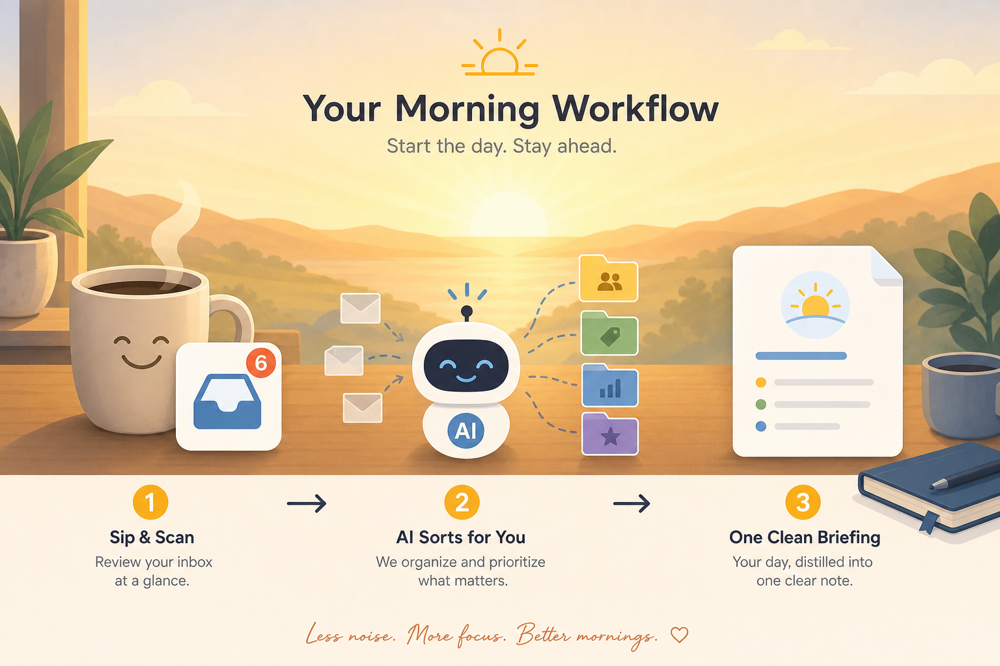
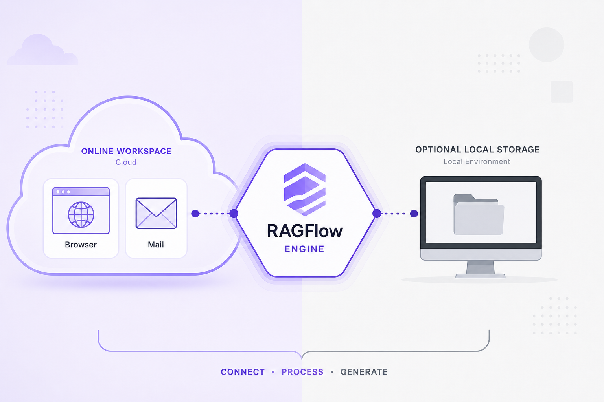

# BriefingRoom

**Turn your inbox into decisions — not noise.**

BriefingRoom is a [RAGFlow](https://github.com/infiniflow/ragflow)-based agent workflow that reads your mail, routes it to specialized desks, and delivers briefings you can act on in minutes.

<p align="center">
  
</p>

---

## What you get

| Capability | How it helps your day |
|------------|----------------------|
| **Intelligent mail routing** | Security, career, life, and briefing paths — each message lands where it matters |
| **Multi-desk specialists** | Dedicated agents for threats, jobs, subscriptions, and everyday life admin |
| **Morning briefing** | One synthesized snapshot instead of scrolling dozens of threads |
| **Inbox triage** | Ask for a security check, career scan, or life cleanup in plain English |
| **Obsidian capture** | Briefings and notes flow into your knowledge base for recall next week |

---

## How it fits your routine

**Morning briefing** — start with one combined view: what needs attention, what's safe to ignore, and what to do next.

**Triage on demand** — reply with a number or natural language:

1. Full inbox briefing (security + career + life)
2. Security check (phishing, account risk, privacy)
3. Career desk (recruiters, roles, events)
4. Life desk (subscriptions, hobbies, admin noise)
5. Find mail by person, subject, or topic
6. Clean-up plan for promos and noise

**Knowledge that sticks** — optional Obsidian integration saves briefings to your vault. You choose the folder; notes stay in your workspace.

---

## Architecture

Online workspace (RAGFlow engine, agents, routing) plus optional local storage you wire yourself — prompts, credentials, and notes can stay offline.

<p align="center">
  
</p>

Details: [Architecture overview](docs/public/architecture-overview.md)

---

## Quick start (self-host)

Prerequisites: Docker, 16GB+ RAM, Python 3.13 if building from source.

```bash
git clone https://github.com/TyanVuon/BriefingRoom.git
cd BriefingRoom

cp docker/.env.mail-intel.example docker/.env.mail-intel
cp config/mail_intel.env.example config/mail_intel.env
# Configure local paths via env — see docs/public/self-host.md

cd web && npm install && npm run build && cd ..

cd docker
docker compose -f docker-compose-mail-intel.yml \
  --env-file .env --env-file .env.mail-intel up -d --build
```

Open **http://localhost** — not a dev port on 9222.

Full guide: [Self-host quickstart](docs/public/self-host.md)

Public docs (GitHub Pages): enable **Settings → Pages → GitHub Actions**; content lives in [`docs/public/`](docs/public/).

---

## Why BriefingRoom

- **Decision-first design** — outputs end with numbered next steps, not walls of raw mail
- **Built on RAGFlow** — agent canvas, connectors, and LLM flexibility
- **Self-hostable** — Docker stack with Infinity, segmented networks, port 80 entry
- **Operator-friendly** — git-safe skeleton; personal prompts and secrets stay local

---

## Documentation

| Doc | Description |
|-----|-------------|
| [Product overview](docs/public/index.md) | Features and daily workflows |
| [Architecture](docs/public/architecture-overview.md) | Online / local split (high level) |
| [Self-host](docs/public/self-host.md) | Docker Mail Intel stack |
| [Mail Intel Docker README](docker/README-mail-intel.md) | Operator runtime notes |

---

## Upstream

BriefingRoom extends **[RAGFlow](https://github.com/infiniflow/ragflow)** (Apache-2.0). Upstream docs, issues, and releases remain at [infiniflow/ragflow](https://github.com/infiniflow/ragflow).

To pull upstream changes:

```bash
git remote add upstream https://github.com/infiniflow/ragflow.git  # if missing
git fetch upstream
```

---

## License

Same as RAGFlow: [Apache License 2.0](LICENSE).
