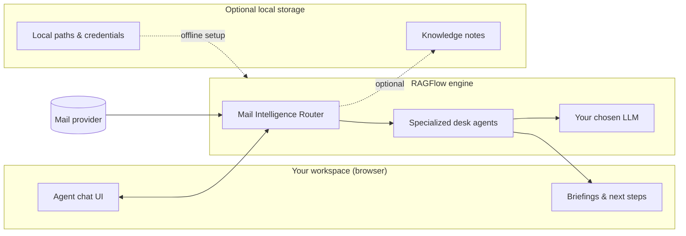

# Architecture overview

Mail Intelligence Router runs as a **RAGFlow agent workflow** with mail connectors and a multi-sector agent graph. The public repo ships runtime-resolved configuration; operators bind credentials and local storage on their own machine.

---

## High-level layout

---

## What runs where

| Layer | Role |
|-------|------|
| **Your workspace** | Chat UI, morning briefing, triage commands |
| **RAGFlow engine** | Agent graph, routing, retrieval, LLM calls |
| **Mail provider** | IMAP or connector — configured by the operator |
| **Optional local storage** | Note capture (e.g. Obsidian), operator-specific paths |

The online half is what you use every day: ask a question, get a routed answer.

The offline half is how operators prepare the environment: copy example env files, set local paths, export deploy credentials in the shell, and start Docker. No step-by-step security wiring is required to understand the product.

---

## Components (conceptual)

1. **InboxIndexer** — structured manifest from recent mail  
2. **CyberSecGate** — first-pass security triage before routing  
3. **Sector routes** — security, career, commerce, platform, briefing  
4. **Miners & verifiers** — extract and corroborate sector-specific facts  
5. **Briefing synthesis** — merges outputs into one actionable response  
6. **Knowledge capture** — optional offline note vault write-back (Obsidian), gated by operator policy  

---

## Deployment shape

Typical self-hosted stack:

- RAGFlow application container (nginx on port 80)  
- MySQL, Redis, MinIO  
- **Infinity** document engine (lighter than Elasticsearch for single-node setups)  
- One-shot init job to register the agent graph  

Details: [Self-host quickstart](self-host.md)

> **Operators:** Local storage, credentials, and path configuration are set via environment files on the host — see the self-host guide and `.example` templates in the repo. Advanced security separation is documented separately for operators and is not part of this public site navigation.
