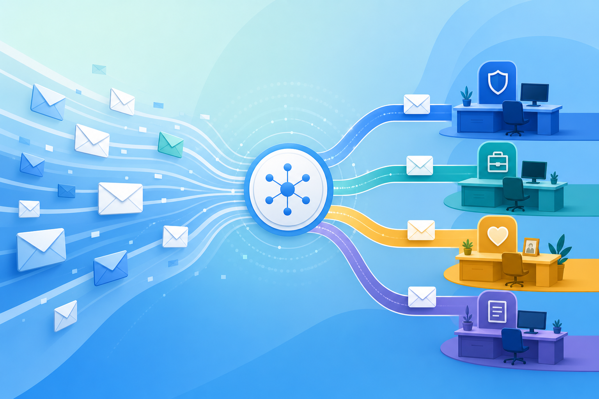

# BriefingRoom

**Turn your inbox into decisions — not noise.**

BriefingRoom is a RAGFlow agent workflow that reads your mail, routes it to specialized desks, and delivers clear briefings you can act on in minutes.

---

## What you get

| Capability | How it helps your day |
|------------|----------------------|
| **Intelligent mail routing** | Security, career, commerce, platform, and briefing paths — each message lands where it matters |
| **Multi-sector specialists** | Gate, miners, verifiers, and synthesis — dedicated agents per signal class |
| **Morning briefing** | One synthesized snapshot instead of scrolling 50 threads |
| **Inbox triage** | Ask for security check, career scan, or life cleanup in plain English |
| **Obsidian capture** | Briefings and notes flow into your knowledge base for recall next week |

---

## How it fits your routine

### Morning briefing

Start the day with a single combined view: what needs attention, what's safe to ignore, and what to do next.

### Triage on demand

Reply with a number or natural language:

1. **Full inbox briefing** — cross-sector synthesis in one pass  
2. **Security check** — phishing, account risk, privacy signals  
3. **Career desk** — recruiters, roles, events (with verification when needed)  
4. **Commerce desk** — auctions, orders, subscriptions, finance noise  
5. **Platform digest** — newsletters, dev notifications, noreply streams  
6. **Find mail** — by person, subject, or topic  

### Career alerts

Route recruiter and opportunity mail to a career specialist that highlights what’s worth your time — without drowning you in LinkedIn noise.

### Knowledge that sticks

Optional Obsidian integration saves briefings and decisions to your vault so context survives beyond the chat window. You choose the folder; your notes stay in your workspace.

---

## Why teams choose it

- **Decision-first design** — outputs end with numbered next steps, not walls of raw mail  
- **Built on RAGFlow** — same agent canvas, connectors, and LLM flexibility you already trust  
- **Self-hostable** — run the full stack on your machine or server with Docker  
- **Operator-friendly** — structural stubs in git; credentials and prompts resolved at runtime via encrypted local vault and HSM unlock  

---

## Learn more

- [Architecture overview](architecture-overview.md) — how online workspace and optional local storage fit together  
- [Self-host quickstart](self-host.md) — Docker stack, Infinity, port 80  

---

*Mail Intelligence Router extends [RAGFlow](https://github.com/infiniflow/ragflow) — open-source RAG and agent engine.*
